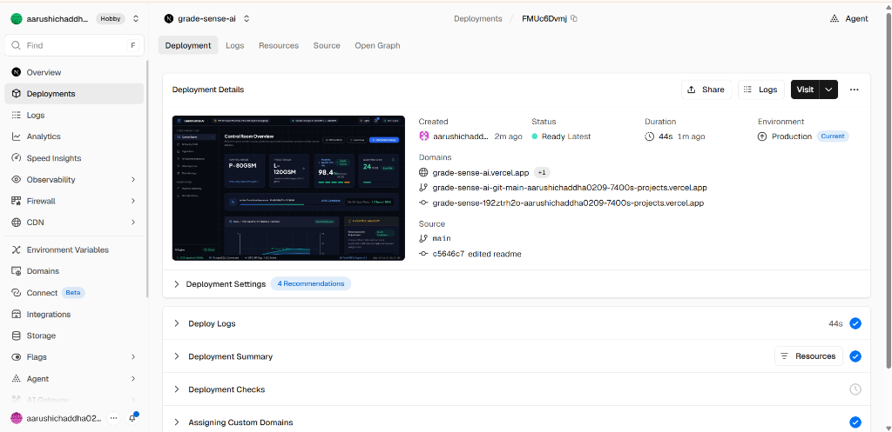
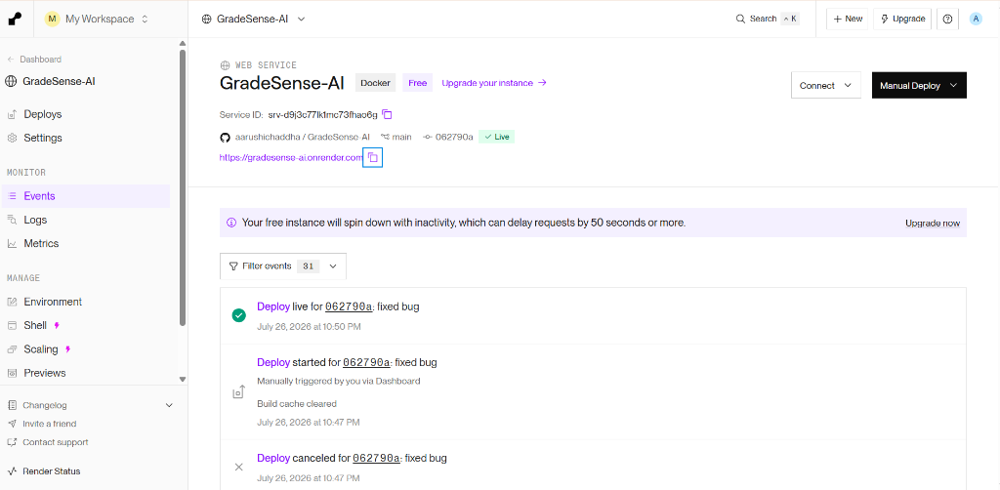
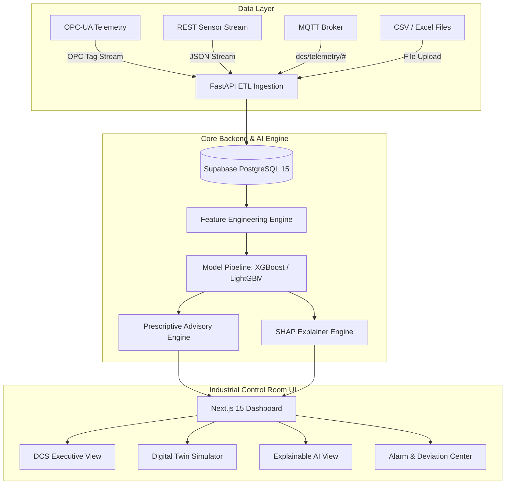

<div align="center">

# 🏭 GradeSense AI
### Enterprise Paper Quality Prediction & Prescriptive DCS Control Advisory

[](https://grade-sense-ai.vercel.app/dashboard)
[](https://fastapi.tiangolo.com)
[](https://nextjs.org)
[](https://supabase.com)
[](https://render.com)
[](https://www.docker.com)

---

### 🌐 Live Production Deployment
**Experience the live industrial control room dashboard:**  
👉 **[https://grade-sense-ai.vercel.app/dashboard](https://grade-sense-ai.vercel.app/dashboard)**

---

**GradeSense AI** is a production-grade enterprise predictive quality and prescriptive control platform built for paper manufacturing facilities. It predicts quality deviations during paper grade transitions, explains root-cause physics using **SHAP (SHapley Additive exPlanations)**, and delivers real-time closed-loop setpoint advisories to minimize off-spec paper waste and transition downtime.

</div>

---

## 📑 Table of Contents
- [🌐 Live Deployment](#-live-deployment)
- [🌟 Key Product Capabilities](#-key-product-capabilities)
- [🏗 System Architecture](#-system-architecture)
- [🎨 Dual Theme Engine](#-dual-theme-engine)
- [🛠 Technology Stack](#-technology-stack)
- [📂 Project Directory Structure](#-project-directory-structure)
- [⚡ Quickstart & Local Setup](#-quickstart--local-setup)
- [☁️ Cloud Deployment Stack](#️-cloud-deployment-stack)
- [🔌 API Endpoints Summary](#-api-endpoints-summary)
- [📚 Documentation](#-documentation)

---

## 🌐 Live Deployment

The platform is fully deployed and accessible live:

| Component | Platform | Deployment URL / Connection |
| :--- | :--- | :--- |
| **Frontend Dashboard** | **Vercel** | 🔗 [grade-sense-ai.vercel.app/dashboard](https://grade-sense-ai.vercel.app/dashboard) |
| **Backend & ML Engine** | **Render** | ⚡ [gradesense-ai.onrender.com/docs](https://gradesense-ai.onrender.com/docs) |
| **Database** | **Supabase** | 🐘 PostgreSQL 15 Managed Instance |

<br/>

<div align="center">

### 🚀 Production Deployment Status

| Frontend (Vercel) | Backend & ML Engine (Render) |
| :---: | :---: |
|  |  |

</div>

---

## 🌟 Key Product Capabilities

| Feature | Description |
| :--- | :--- |
| 🎛️ **DCS Executive Control Room** | High-density operational dashboard designed for paper machine operators with real-time SCADA telemetry, moisture/basis weight gauges, SPC spec bands, and animated transition curves. |
| 🌓 **Dynamic Dual Theme Engine** | Seamless instant toggling between **Modern Light Theme** (clean slate canvas for daylight operation) and **Dark DCS Control Room Theme** (high-contrast dark environment). |
| 🤖 **Auto-Tuning ML Pipeline** | Trains, cross-validates, and evaluates **Random Forest**, **XGBoost**, and **LightGBM** models across 25+ engineered process features. Automatically persists top model by F1-macro. |
| 🧠 **SHAP Explainable AI (XAI)** | Translates complex ML model decision boundaries into plain operator-friendly language, feature contribution percentages, and historical normal range comparisons. |
| 💡 **Prescriptive AI Advisory Engine** | Combines AI predictions, DCS physics rule evaluation, and historical transition matching to advise optimal setpoint adjustments (e.g. *Increase Steam Pressure*, *Reduce Machine Speed*). |
| 🔬 **Digital Twin What-If Simulator** | Interactive sandbox allowing operators to tune process sliders (speed, steam pressure, stock flow) and simulate real-time quality settling timelines and broke waste reduction. |
| 📥 **Multi-Protocol Telemetry ETL** | Ingests multi-format CSV/Excel files, REST streams, MQTT topics, and OPC-UA tags. Automatically prunes duplicates and clips $3\sigma$ Z-score outliers. |

---

## 🏗 System Architecture



---

## 🎨 Dual Theme Engine

GradeSense AI features a built-in React Theme Context provider supporting dual color systems tailored for industrial environments:

- **☀️ Light Mode**: Optimized for bright operator offices (`#f8fafc` canvas, `#ffffff` card surfaces, `#0284c7` primary sky blue accents).
- **🌙 Dark DCS Mode**: Optimized for control room displays (`#070a11` dark canvas, `#0e1424` card surfaces, `#1e2945` high-contrast grid borders).

Operators can switch modes instantly via the top header **Sun/Moon Toggle Button**, with preferences persisted across browser sessions via `localStorage`.

---

## 🛠 Technology Stack

### **Frontend**
- **Core Framework**: [Next.js 15](https://nextjs.org) (React 19, TypeScript)
- **Styling**: Tailwind CSS, Vanilla CSS design tokens, custom dark/light color palette
- **Data Visualization**: Recharts animated trend graphs, SVG section gauges, SPC spec bands
- **Icons**: Lucide React

### **Backend**
- **Core Framework**: [FastAPI 0.115](https://fastapi.tiangolo.com) (Python 3.11) with Repository-Service architecture
- **Database**: PostgreSQL 15 with range-partitioned telemetry tables & BRIN indexes
- **ORM & Migrations**: SQLAlchemy 2.0 Async, Alembic
- **Machine Learning**: `scikit-learn`, `xgboost`, `lightgbm`, `shap` (TreeExplainer), `joblib`
- **Security**: OAuth2 Bearer JWT authentication, bcrypt password hashing

### **Cloud & DevOps Infrastructure**
- **Frontend Hosting**: Vercel
- **Backend Hosting**: Render Web Service
- **Database Hosting**: Supabase PostgreSQL
- **Containerization**: Docker multi-stage builds & Docker Compose orchestration

---

## 📂 Project Directory Structure

```
GradeSense-AI/
├── backend/
│   ├── app/
│   │   ├── ai/                 # ML Engine: Feature engineering, Training, SHAP Explainer
│   │   ├── api/v1/endpoints/   # REST Controllers: Predictions, Simulator, Ingestion, Auth
│   │   ├── core/               # Configuration, Database sessions, Security
│   │   ├── crud/               # Database Repositories
│   │   ├── db/                 # Database DDL schemas & seed scripts
│   │   ├── models/             # SQLAlchemy ORM Data Models
│   │   ├── schemas/            # Pydantic DTO validation schemas
│   │   └── services/           # Business Logic: Recommendation Engine & ETL Pipeline
│   ├── artifacts/              # Trained ML models (.joblib) & manifests
│   ├── data/                   # SCADA telemetry training datasets
│   └── tests/                  # Pytest Unit & Integration tests
├── frontend/
│   ├── src/
│   │   ├── app/(dashboard)/    # Operational Dashboard Views
│   │   ├── components/         # Cards, Gauges, Charts, Modal, Header, Sidebar
│   │   ├── context/            # React Theme Context (Light / Dark mode engine)
│   │   ├── lib/                # API helpers & utilities
│   │   └── styles/             # Global CSS design tokens
│   └── package.json
├── docs/                       # Project setup & deployment guides
├── docker-compose.yml          # Container orchestration
└── README.md
```

---

## ⚡ Quickstart & Local Setup

### **Prerequisites**
- Node.js `>= 18.0`
- Python `>= 3.11`
- PostgreSQL `>= 15` (or Docker)

### **Option A: Local Development Mode**

#### **1. Backend Setup**
```bash
cd backend
python -m venv venv
source venv/bin/activate  # On Windows: venv\Scripts\activate
pip install -r requirements.txt

# Run FastAPI server
python -m uvicorn app.main:app --port 8000 --reload
```

#### **2. Frontend Setup**
```bash
cd frontend
npm install
npm run dev
```
Open **`http://localhost:3000`** in your browser.

---

### **Option B: Production Stack via Docker Compose**

```bash
# 1. Clone repository & configure environment
cp .env.example .env

# 2. Launch production stack
docker-compose up -d --build

# 3. Access Industrial Dashboard
open http://localhost
```

---

## 🔌 API Endpoints Summary

| Method | Endpoint | Description |
| :--- | :--- | :--- |
| `GET` | `/health` | Service health probe & telemetry status |
| `POST` | `/api/v1/predictions/predict` | Predict off-spec probability for target grade transition |
| `POST` | `/api/v1/predictions/explain` | Generate SHAP waterfall & feature attribution explanations |
| `GET` | `/api/v1/recommendations/` | Fetch active prescriptive process advisories |
| `POST` | `/api/v1/recommendations/{id}/accept` | Accept advisory & dispatch setpoint to OPC-UA controller |
| `POST` | `/api/v1/simulator/run` | Execute Digital Twin What-If process simulation |
| `POST` | `/api/v1/ingestion/upload` | Upload CSV/Excel telemetry for automated ETL processing |

Interactive API documentation is available at **`http://localhost:8000/docs`** (Swagger UI).

---

## 📚 Documentation

- 📄 [Installation & Setup Guide](docs/INSTALLATION.md)
- 🚀 [Cloud & Production Deployment Guide](docs/DEPLOYMENT.md)
- 💾 [Database Backup & Restore Guide](docs/DATABASE_BACKUP.md)

---

<div align="center">

**GradeSense AI** • Enterprise Predictive Quality Platform  
Developed for Modern Paper Manufacturing & Industrial Automation

</div>
